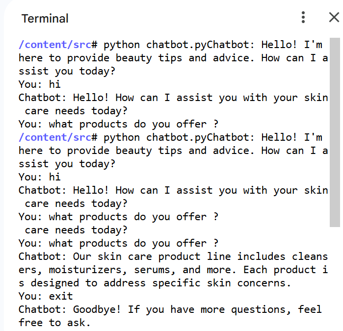

# 💄 Beauty Chatbot (Rule-Based)

A simple rule-based chatbot built using Python that provides beauty and skincare tips.  
It uses a JSON dataset of intents and responds to user queries through pattern matching.

---

## 📂 Project Structure

Beauty-chatbot/

data/
   ── Beauty_instructor.json   # Dataset (intents & responses)

src/
   ── chatbot.py               # Main chatbot logic

README.md                    # Project documentation

---

## ⚙️ Features

- Rule-based response system  
- Uses JSON intent dataset  
- Terminal based interaction  
- Easy to customize & extend  
- Beginner friendly  

---

## 🛠️ Technologies Used

- Python 3  
- JSON  
- Random module  

---

## 🚀 How to Run

### 1. Clone the repository
git clone https://github.com/kalpanabhardwaj323-prog/Beauty-chatbot.git

### 2. Go inside the project folder
cd Beauty-chatbot

### 3. Run the chatbot
cd src  
python chatbot.py

---

## 💬 Example Chat

Chatbot: Hello! I'm here to provide beauty tips and advice.  
You: what products do you offer?  
Chatbot: Our skin care product line includes cleansers, moisturizers, serums, and more.

Type exit to stop the chatbot.

---
## 📸 Demo

---
## 📌 Future Improvements

- Add NLP using NLTK or spaCy  
- GUI or Web interface  
- More datasets  
- Voice support  

---

## 👩‍💻 Author

Kalpana Bhardwaj  
BTech CSE (AI & ML)  
LinkedIn: https://www.linkedin.com/in/kalpana-bhardwaj-1551b52b2/

